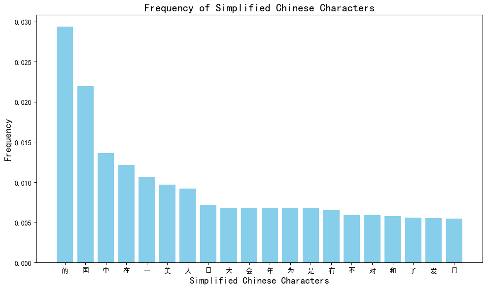
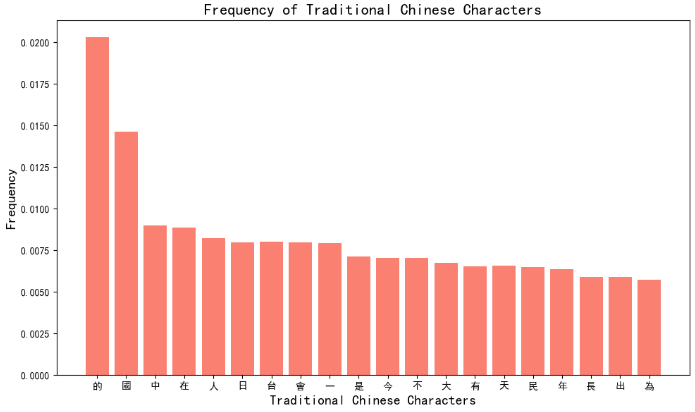

# Are the same characters used in Simplified and traditional Chinese news articles ?

I will be using a datasets with more than 140 000 newspapers articles and separate the articles written in simplified Chinese from the ones in traditional Chinese.

After that I counted the frequency of all the word presents in order to study if they would be a significient difference between the 20 most used characters in traditional and simplified Chinese articles and try to come up with an explanation.

Here are the final result :

> The frequency scale is not exactly the same because they are more traditional Chinese articles

We can see that it starts to change from the fouth character. Which is quite surprising because both simplified and traditional characters has the same exact meaning. The difference is only the writing style or the "font" of the characters.

The only really difference between the two writing style is where they are used.
Traditional Chinese is typically used in Taïwan, Hong-Kong and Macau where simplified Chinese is used everywhere else in the Chinese speaking world.

It means that even on a very large scale of data the use of words varies from the place the articles are written. Even if these places are all in China.

For example 美(mei) means "Beautiful" but is more commonly used as the name of America as a country 国美(meiguo). Is the fifth most used word in Simplified but doesnt make it to the top 20 in traditional articles, meaning that articles from the classic mainland China talk way more about America than the others articles. 日(ri) Means day but is more used to name Japan, it's also used a lot in simplified Chinese articles but not the traditional ones, this means that simplified articles tend to talk more about other countries.

Without surprise articles in traditional Chinese tends to use 台(tai) which is the character for Taiwan a lot and is not much used in simplified articles.

However, we can notice that they both use 中(zhong) which means middle but is also used to name China as a country 中国(zhongguo), as often.